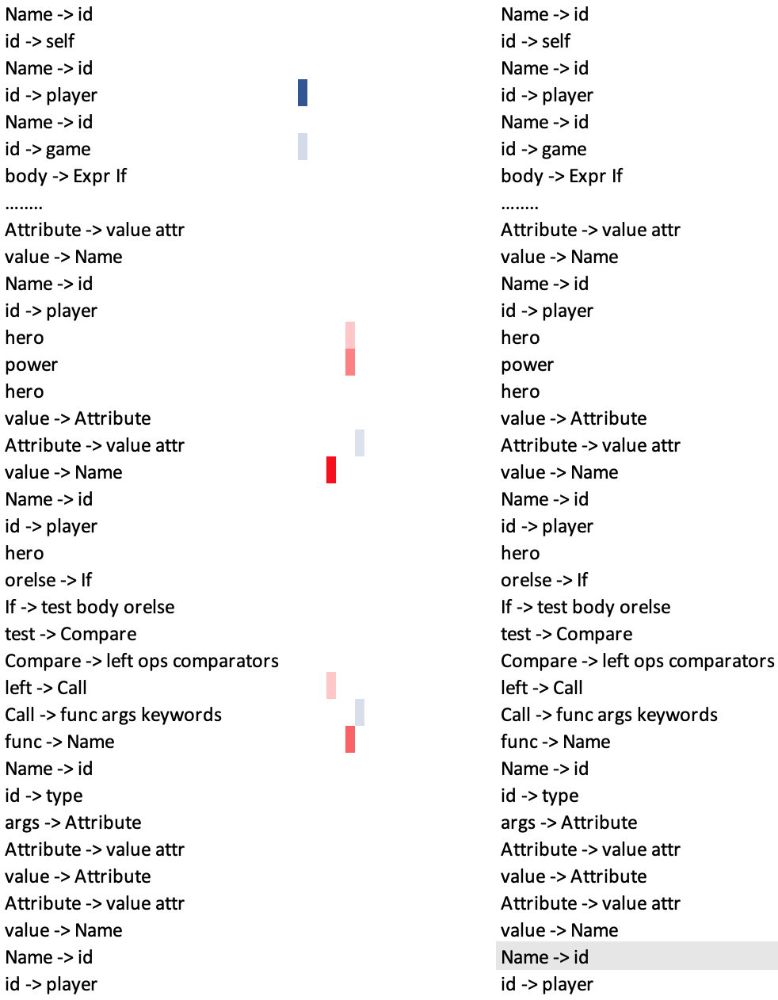
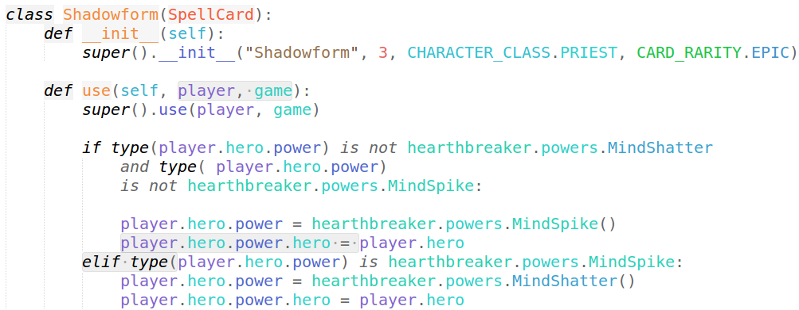
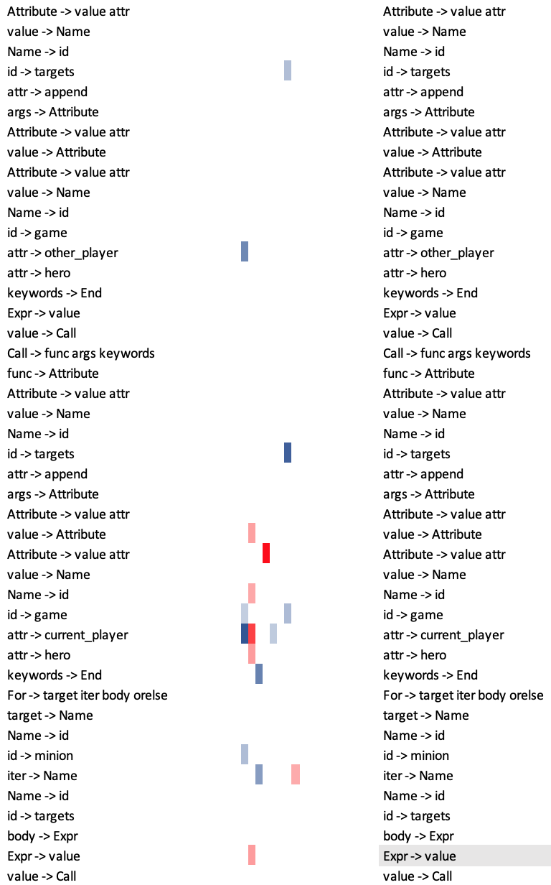
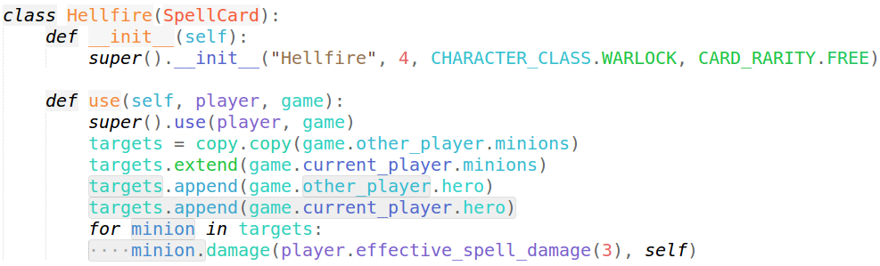

# TreeGen
A Tree-Based Transformer Architecture for Code Generation.

Our paper is available at https://arxiv.org/abs/1911.09983. (Accepted by AAAI'20)

This repository is not a complete one, and we will complete it soon. 
## Usage
### To train a new model
```
python3 run.py ATIS|HS-B
```
### To predict the code (ATIS)
```
python3 predict.py ATIS 5
```
where ```5``` is the beam size.
### To predict the code (HS)
```
python3 predict_HS-B.py HS 5
```
### To check the results 
```
python3 eval.py ATIS|HS-B
```

## Dependenices
* NLTK 3.2.1
* Tensorflow 1.12.1
* Python 3.7
* Ubuntu 16.04

## Attention Visualization


An example of the attention mechanism following the long-distance dependencies in the partial AST reader self-attention in layer 3. The node ```Name -> id``` (the parent node of ```player```) in the line ```elif type(player.hero.power) is hearthbreaker.powers.MindSpike:``` denotes the information of the value of function ```type```. As shown, this node relies on complex information, which contains the variables ( ```player``` and  ```game```, in the defination of function), the body of if statement, and the structure of ```elif```. Different colored columns represent different heads. 


An example of the attention mechanism in the partial AST reader self-attention in layer 1. The node ```Expr -> value``` in the line ```minion.damage(player.effective_spell_damage(3), self)``` decides the type of this statement, which mostly relies on the previous statements of the function ```use``` and the variable ```targets``` and ```minion``` as shown.
